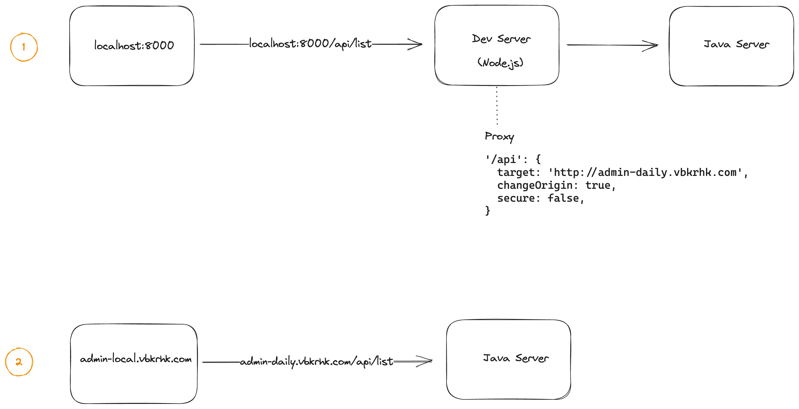
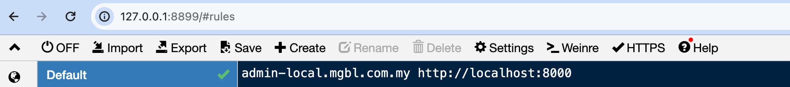
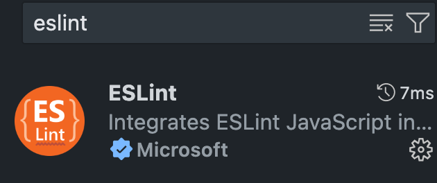
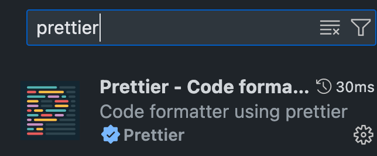
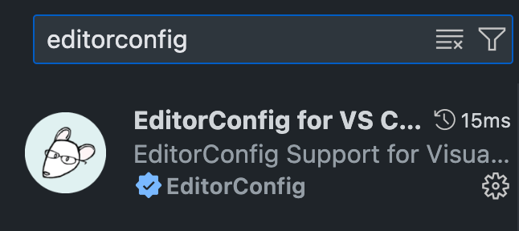
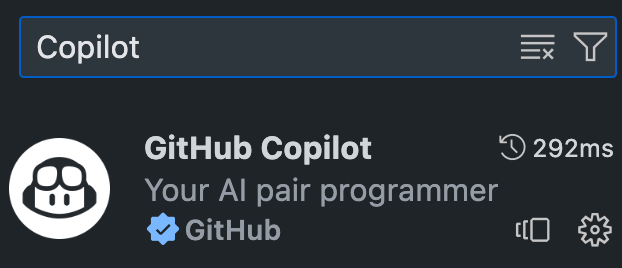
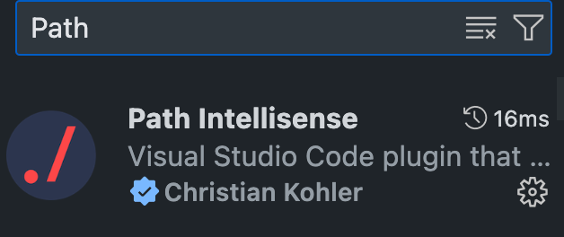
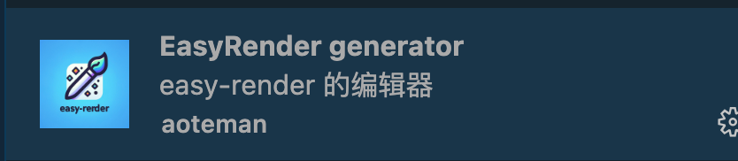

## 简介

%%projectName%%系统

## 使用

### 安装依赖

```bash
npm i --force
`````

### 启动
```bash
npm start
```

### 代理

在 `npm start` 启动完毕后，有两种访问前端页面的方式：

1. 访问 `localhost:8000`
2. 访问 `admin-local.vbkrhk.com`

访问页面只是第一步，下一步，还需要访问后端接口，



第一种方式较为常见，在发起接口请求前，需要将 `cookie` 种到浏览器里面，且需要在 `devServer` 中配置相应的 `proxy`

第二种方式，是通过某种代理软件，访问 `admin-local.vbkrhk.com` 即访问 `localhost:8000`，

有几点好处：
- 大部分情况下，不需要手动种 `cookie`
- 接口请求可以直接访问 `admin-daily.vbkrhk.com`，而不需要去 `devServer` 中配置 `proxy`

如常见的（✨免费）代理软件 `whistle`，可以设置代理规则如下：
```
admin-local.mgbl.com.my http://localhost:8000
```



> 附 whistle 链接：https://wproxy.org/whistle/

## 更好的开发体验
使用 `vscode` 开发时，推荐安装如下 `vscode` 插件：
1. 
2. 
3. 
4. 
5. 
6. 


